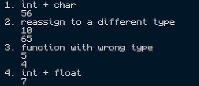

# C Runtime Documentation

## Environment
- Compiler: [first line of `gcc --version`]
- Compile: `gcc main.c -o main`
- Run: `.\main`

## Type System
- **Static:** every variable has a type fixed at compile time (`int`, `char`) and the compiler checks it before the program runs.
- **Weak:** the compiler silently converts between types. A `char` is treated as an integer, and a `double` is truncated when assigned or passed to an `int`.

## Execution Strategy
**Ahead-of-time (AOT) compilation.** gcc translates the source into a native machine-code executable (`main.exe`). The program runs directly on the CPU with no VM or interpreter.

## Results

| Test | Result | Why |
|---|---|---|
| 1. `5 + '3'` | `56` | `'3'` is the number 51 |
| 2. `v = 'A'` | `65` | char converted to int |
| 3. `add_one(3.9)` | `5` | 3.9 truncated to 3, then +1 |
| 4. `int r = 5 + 2.5` | `7` | 7.5 truncated on assignment |

## Observations
The program compiled and ran without any errors, but several values were silently changed. `5 + '3'` printed `56` because the character `'3'` is stored as the number 51. Passing `3.9` to `add_one` printed `5` because the decimal part was truncated, and `int r = 5 + 2.5` stored `7` instead of `7.5`. Types are fixed at compile time (static), yet the compiler converts between them without stopping me, which makes C weakly typed. The compiled executable ran directly without an interpreter or VM.