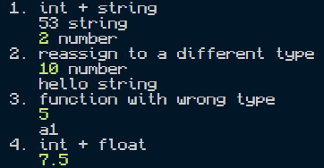

# JavaScript Runtime Documentation

## Environment
- Runtime: **Node.js v24.19.0**
- Engine: V8
- Run from `javascript/`: `node main.js`
- Version command: `node --version`

## Type system
- **Dynamic:** A `let` binding can hold a `number` and later a `string`.
- **Conventionally weak:** JavaScript frequently coerces operands implicitly. The rules differ by operator: `5 + "3"` concatenates, while `5 - "3"` performs numeric subtraction.

## Execution strategy
Node.js uses the V8 JavaScript engine, which can interpret bytecode and optimize selected paths using just-in-time compilation. Not every statement must be JIT-compiled. The execution strategy is distinct from the language's type system.

## Results

| Test | Result | Explanation |
|---|---|---|
| `5 + "3"` / `5 - "3"` | `"53"` (`string`) / `2` (`number`) | `+` concatenates with a string; `-` coerces the string to a number. |
| Reassign `v` from number to string | Allowed | `typeof v` changes from `number` to `string`. |
| `addOne("a")` | `"a1"` | `+` concatenates when the argument is a string. |
| `5 + 2.5` | `7.5` | Both literals are JavaScript `number` values, not separate `int` and `float` types. |

## Observations
The four examples do not throw errors, but that is not a universal property of JavaScript. For example, adding `1n + 1` mixes `BigInt` and `Number` and raises `TypeError`. The differing results of `+` and `-` highlight operator-specific conversion rules rather than an absence of type checking.
