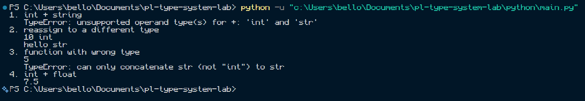

# Python Runtime Documentation

## Environment
- Interpreter: **Python 3.14.7**
- Run from `python/`: `python main.py`
- Version command: `python --version`

## Type system
- **Dynamic:** Names can refer to values of different types. `v` is first bound to an integer and then to a string.
- **Strong:** Python does not automatically turn `"3"` into an integer for addition with `5`, but it does support compatible mixed numeric arithmetic such as `5 + 2.5`.

## Execution strategy
CPython internally compiles code to bytecode and executes it with its virtual machine. Imported modules may be cached as `.pyc` files, but the user does not need a separate compilation step or a `.pyc` file for the directly executed script.

## Results

| Test | Result | Explanation |
|---|---|---|
| `5 + "3"` | `TypeError` | Invalid integer/string addition is detected at runtime. |
| Reassign integer name to string | Allowed | The name is rebound; the original integer's type does not change. |
| `add_one("a")` | `TypeError` | Function call is accepted, but `n + 1` fails when executed. |
| `5 + 2.5` | `7.5` | Compatible mixed numeric arithmetic produces a float. |

## Observations
The `try/except TypeError` blocks catch the two runtime failures so execution can continue. Dynamic typing allows name rebinding without implying that all combinations of values are valid. Strong typing here means Python does not silently convert strings to numbers for the illustrated addition, not that all implicit numeric conversions are forbidden.
