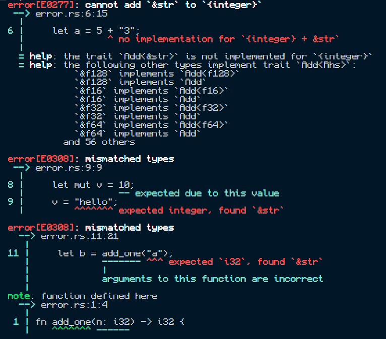
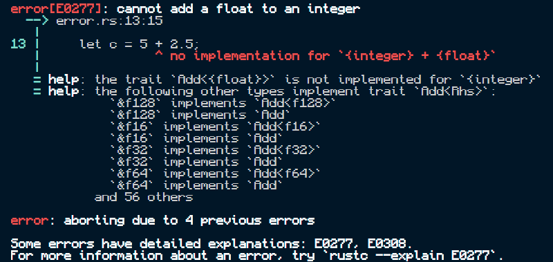
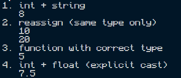

# Rust Runtime Documentation

## Environment
- Version: [output of `rustc --version`]
- Compile and run (working version): `rustc main.rs` then `.\main`
- Compile (failing version): `rustc error.rs`

## Type System
- **Static:** types are checked at compile time. A variable inferred as an integer can't later hold a string (test 2).
- **Strong:** there are no implicit conversions, even between `i32` and `f64`. Conversions must be written explicitly (`as f64`, `.parse()`).

## Execution Strategy
**Ahead-of-time (AOT) compilation.** `rustc` type-checks the whole program, then produces a native executable. If any type check fails, **no executable is produced** and the program never runs.

## Results

### `error.rs` (rejected by the compiler)

| Test | Error | Meaning |
|---|---|---|
| 1. `5 + "3"` | E0277 | No `Add` between integer and `&str` |
| 2. `v = "hello"` | E0308 | Variable type can't change |
| 3. `add_one("a")` | E0308 | Expected `i32`, found `&str` |
| 4. `5 + 2.5` | E0277 | Can't add float to integer |

All four errors were reported together at compile time.

### `main.rs` (corrected version)

The same four ideas compile only when every conversion is explicit, and the output is `8`, `10`, `20`, `5`, `7.5`.

## Observations
`error.rs` failed to compile, so no executable was created and the program never ran. All four mistakes were reported together before execution, which shows that Rust checks types statically. It also refused to mix an integer with a float or a string, so Rust is strongly typed. To fix the program (`main.rs`), I had to write every conversion explicitly, such as `"3".parse()` and `x as f64`. Compared to the other languages, Rust moves bugs from runtime to compile time.